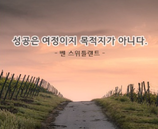

# 네 번째 회고

## 2025-09-14 (일요일)

### 학습을 되돌아보며

> "성공은 여정이지 목적지가 아니다"

벌써 학원에 다닌 지 약 4주가 되었다.

 이번 주는 그리드 위주로 나가는 수업이다. UI를 만드는 방법에 있어서 grid는 어떻게해서든 알아야 할 배움이라고 생각이 들었다. 실습을 진행하는데 특히 그리드 구조를 다 만들고 css 작업을 시작하는데 작업 도중에 아..구조를 잘못 만들었구나를 인지했을 때 진짜 힘들었다 ㅠㅠ 처음 수업을 듣고 못 따라 갔을 때 조금씩 밀리기 시작하니 점점 현타가 오기 시작했지만 회고시간과 복습을 통해 조금이나마 따라갈 수 있었다. 항상 오늘의 나보다 내일 더 성장해서 다음수업에 차질이 없도록 나아가는 내가 되어야한다.

 항상 복습 또 복습하자!! 아직은 벅차지만 수업 시간에 나간 UI를 다시 만지고 따라 해보면서 조금씩 적응중이다. 어떠한 고난이 와도 끝까지 가면 이기듯 참고 달리자. __남들과 똑같이 하면 똑같은 사람일 뿐이고 잘 되길 바라는건 욕심쟁이다.__ 더욱더 성장할 수 있는 내가 되도록 움직이자 승규야 제발 ㅠㅠ 잠이 너무 많다.. 

항상 슬비쌤 짧은 기간 동안 하나라도 더 알려주시려는 마음 진심으로 감사합니다 ㅎㅎ